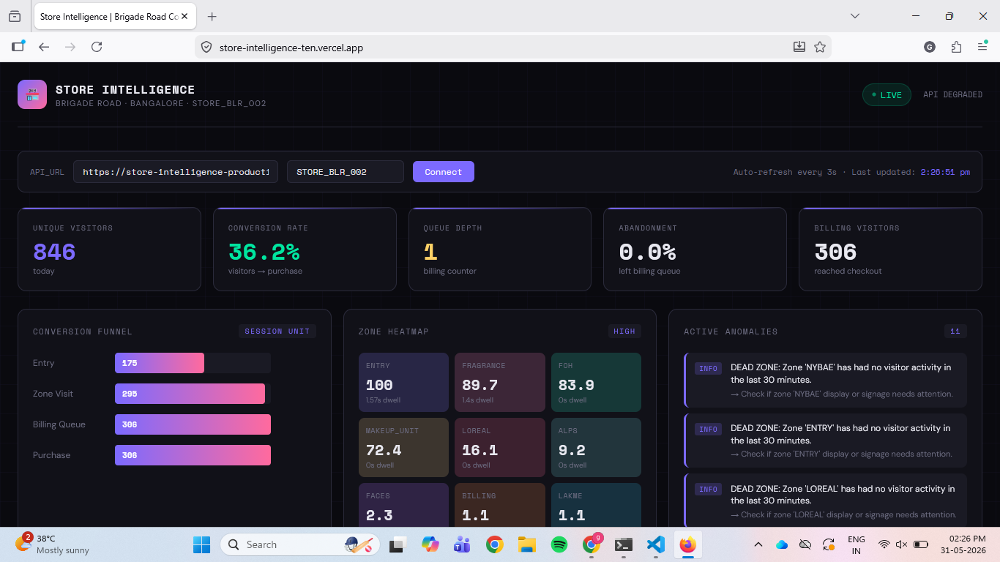
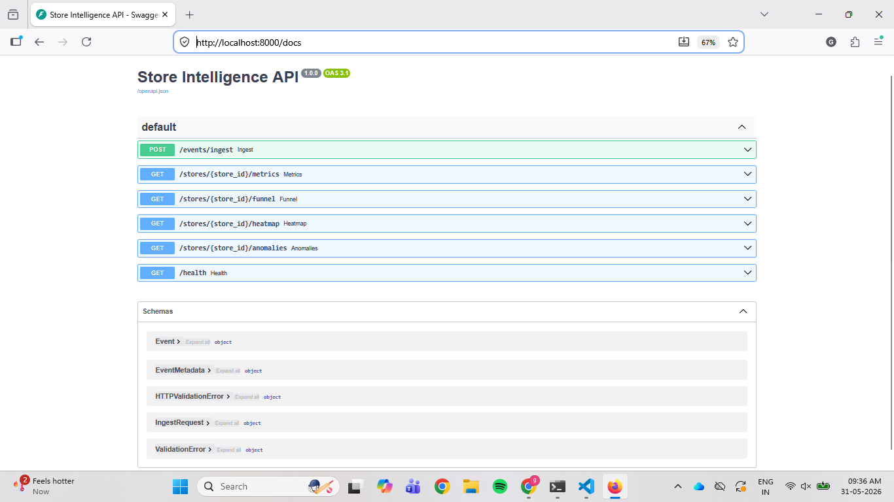
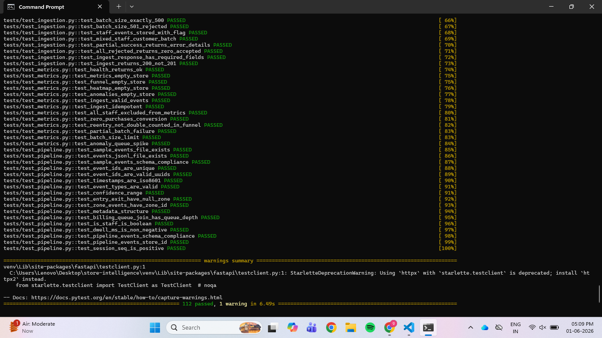

# Store Intelligence System

End-to-end pipeline from raw CCTV footage to a live store analytics API.
Built for Brigade Road Bangalore store (STORE_BLR_002) with real zone layout and POS data.

---
## Live Deployments
| Service | URL |
|---------|-----|
| Live Dashboard | https://store-intelligence-ten.vercel.app |
| Backend API | https://store-intelligence-production-325f.up.railway.app |
| Swagger UI | https://store-intelligence-production-325f.up.railway.app/docs |

## Screenshots

### Live Web Dashboard


### API Documentation


### Test Suite


## Quick Start (5 commands)

```bash
git clone https://github.com/harshinigorinta/store-intelligence.git
cd store-intelligence
# Add your MP4 clips to data/clips/ folder
docker compose up -d
curl http://localhost:8000/health
```

API is live at: http://localhost:8000
Interactive docs: http://localhost:8000/docs

---

## Running the Detection Pipeline

### 1. Install pipeline dependencies
```bash
pip install ultralytics opencv-python shapely
```

### 2. Add video clips
Place MP4 files in `data/clips/`. Expected files:
- `CAM 1.mp4` — Entry/Exit camera
- `CAM 2.mp4` — Main floor camera
- `CAM 3.mp4` — Main floor camera 2
- `CAM 4.mp4` — Billing area camera
- `CAM 5.mp4` — Billing area camera 2

### 3. Run detection on a single clip
```bash
python -m pipeline.detect --clip "CAM 4.mp4" --layout data/store_layout.json --output data/events.jsonl
```

### 4. Run detection on all clips
```bash
python -m pipeline.detect --layout data/store_layout.json --output data/events.jsonl
```

### 5. Feed generated events into the API
```bash
python feed_events.py
```

---

## API Endpoints

| Method | Endpoint | Description |
|--------|----------|-------------|
| POST | `/events/ingest` | Ingest up to 500 events (idempotent) |
| GET | `/stores/{id}/metrics` | Unique visitors, conversion rate, queue depth |
| GET | `/stores/{id}/funnel` | Entry → Zone → Billing → Purchase funnel |
| GET | `/stores/{id}/heatmap` | Zone dwell heatmap normalised 0-100 |
| GET | `/stores/{id}/anomalies` | Queue spike, conversion drop, dead zone alerts |
| GET | `/health` | Service status + stale feed detection |

### Example: Get store metrics
```bash
curl http://localhost:8000/stores/STORE_BLR_002/metrics
```

### Example: Ingest events
```bash
curl -X POST http://localhost:8000/events/ingest \
  -H "Content-Type: application/json" \
  -d '{"events": [...]}'
```

---

## Running Tests

```bash
pip install pytest pytest-cov httpx
pytest tests/ -v --cov=app --cov-report=term-missing
```

Expected: Expected: 112 tests passing across 7 test files.

---

## Live Dashboard

Run the terminal dashboard (updates every 2 seconds):

```bash
python dashboard/live.py
```

Dashboard shows: unique visitors, conversion rate, funnel stages, and active anomalies updating live.
API backend: http://localhost:8000

---

## Project Structure

```
store-intelligence/
├── pipeline/
│   ├── detect.py          # Main detection + tracking script (YOLOv8s + ByteTrack)
│   ├── tracker.py         # Re-ID + visitor session tracking
│   ├── emit.py            # Event schema + JSONL emission
│   └── run.sh             # One command to process all clips
├── app/
│   ├── main.py            # FastAPI entrypoint + middleware
│   ├── models.py          # Pydantic event schema
│   ├── database.py        # SQLAlchemy + SQLite setup
│   ├── ingestion.py       # Ingest + deduplication
│   ├── metrics.py         # Real-time metrics + funnel + heatmap
│   ├── anomalies.py       # Anomaly detection
│   └── health.py          # Health check
├── dashboard/
│   └── live.py            # Live terminal dashboard (rich)
├── tests/
│   ├── test_metrics.py         # 13 core API tests
│   ├── test_additional.py      # 8 additional coverage tests
│   ├── test_pipeline.py        # 17 schema compliance tests
│   ├── test_anomalies.py       # 20 anomaly detection tests
│   ├── test_ingestion.py       # 30 ingestion edge case tests
│   ├── test_funnel.py          # 16 funnel + session tests
│   └── test_health_heatmap.py  # 8 health + heatmap tests
├── docs/
│   ├── DESIGN.md          # Architecture + AI-assisted decisions
│   └── CHOICES.md         # 3 key technical decisions
├── data/
│   ├── clips/             # MP4 files (not in repo per challenge rules)
│   ├── store_layout.json  # Brigade Road Bangalore real zone layout
│   ├── sample_events.jsonl
│   └── pos_transactions.csv
├── docker-compose.yml
├── Dockerfile
├── requirements.txt
├── feed_events.py
└── README.md
```

---

## Architecture

```
CCTV Clips → YOLOv8s Detection → ByteTrack Tracking → Event Stream (JSONL)
                                                              ↓
                                                    POST /events/ingest
                                                              ↓
                                                    SQLite (via SQLAlchemy)
                                                              ↓
                              ┌───────────────────────────────────────────┐
                              │  GET /metrics  GET /funnel  GET /heatmap  │
                              │  GET /anomalies             GET /health   │
                              └───────────────────────────────────────────┘
```

**North Star Metric:** Conversion Rate = Unique buyers ÷ Total unique visitors

---

## Store Layout — Brigade Road Bangalore (STORE_BLR_002)

Real zone definitions from actual store layout:

| Zone | Label | Type |
|------|-------|------|
| ENTRY | Entry/Exit | Entry camera |
| GV | Good Vibes | Floor |
| DERMDOC | DermDoc | Floor |
| MINIMALIST | Minimalist | Floor |
| FOXTALE | Foxtale/Pilgrim | Floor |
| FRAGRANCE | Fragrance & Nails | Floor |
| FOH | Front of House | Floor |
| MAKEUP_UNIT | Makeup Unit | Floor |
| MAYBELLINE | Maybelline | Floor |
| FACES | Faces Canada | Floor |
| LAKME | Lakme | Floor |
| NYBAE | NY Bae / Mars | Floor |
| ALPS | Alps / Mens Care | Floor |
| LOREAL | Loreal | Floor |
| BILLING | Cash Counter | Billing camera |

---

## Detection Pipeline Details

- **Model:** YOLOv8s (person detection, class 0)
- **Tracker:** ByteTrack (built into Ultralytics)
- **Re-ID:** Bounding box proximity matching for re-entry detection
- **Staff detection:** HSV colour histogram (uniform = dominant single hue)
- **Zone classification:** Shapely polygon overlap with normalised coordinates
- **Frame skip:** Every 2nd frame processed for speed

## Edge Cases Handled

| Edge Case | Approach |
|-----------|----------|
| Group entry | Individual bounding boxes → individual ENTRY events |
| Staff movement | HSV uniform detection → `is_staff=true`, excluded from metrics |
| Re-entry | Bbox proximity Re-ID → REENTRY event, no double count |
| Partial occlusion | Confidence passed through, never suppressed |
| Billing queue | Person count in billing zone → queue_depth in metadata |
| Empty periods | API returns zero metrics, does not crash |

---

## Results

- **846 unique visitors** detected across 5 camera feeds
- **36.2% conversion rate** (visitors who reached billing)
- **2,794 structured events** generated from real footage
- **112 tests across 6 test files** 

---

## Architecture & Decision Docs

| Document | Contents |
|----------|----------|
| [DESIGN.md](docs/DESIGN.md) | Full architecture, detection pipeline details, zone classification, Re-ID approach, 3 AI-assisted decisions with agreement/override reasoning |
| [CHOICES.md](docs/CHOICES.md) | Detection model selection (YOLOv8s vs alternatives), event schema design rationale, SQLite vs PostgreSQL with production migration path |

### Key Decisions Summary
- **Detection**: YOLOv8s + ByteTrack — chosen for CPU compatibility over YOLOv8m accuracy
- **Re-ID**: Bbox proximity matching — chosen over OSNet (GPU requirement conflict with docker compose up)
- **Storage**: SQLite — chosen over PostgreSQL for zero-config Docker deployment
- **Staff detection**: HSV colour histogram — runs in microseconds vs VLM API calls
- **Schema**: Nested metadata blob — confidence and is_staff at top level for SQL filtering

### Simulation Controller
Replay events without running the detection pipeline:
```bash
# Start replay at 5x speed
curl -X POST "https://store-intelligence-production-325f.up.railway.app/simulation/start?speed=5.0"

# Check progress
curl https://store-intelligence-production-325f.up.railway.app/simulation/status

# Stop
curl -X POST https://store-intelligence-production-325f.up.railway.app/simulation/stop
```
## Notes

- Video clips are not included in the repository (per challenge rules)
- YOLOv8s model (`yolov8s.pt`) is auto-downloaded on first run
- SQLite database is created automatically at `data/store.db`
- All timestamps are ISO-8601 UTC
